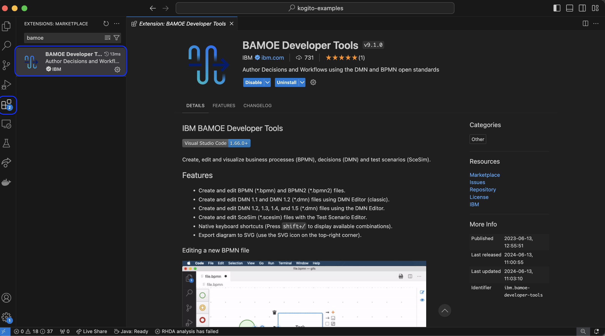
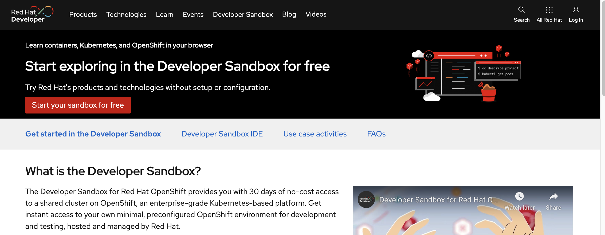
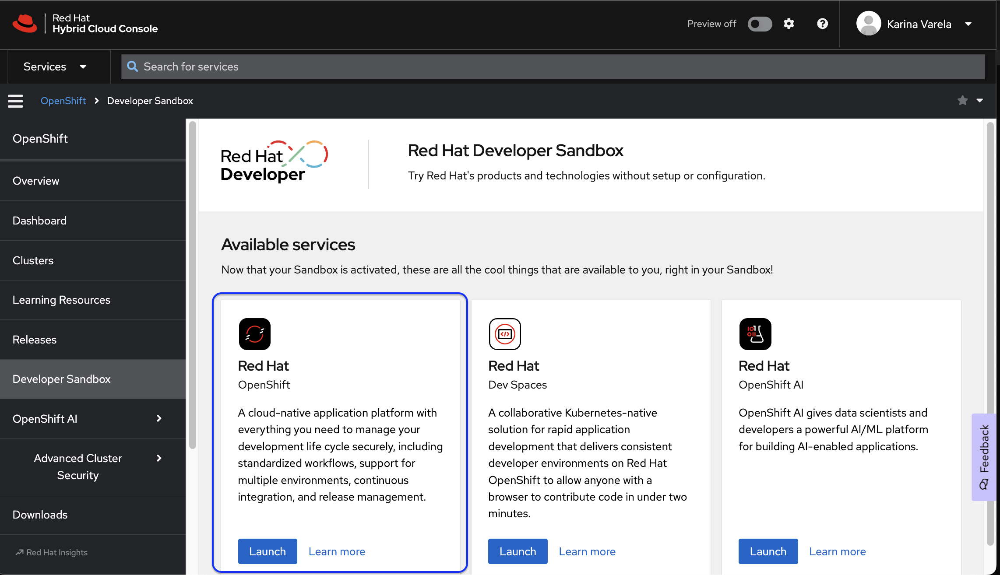
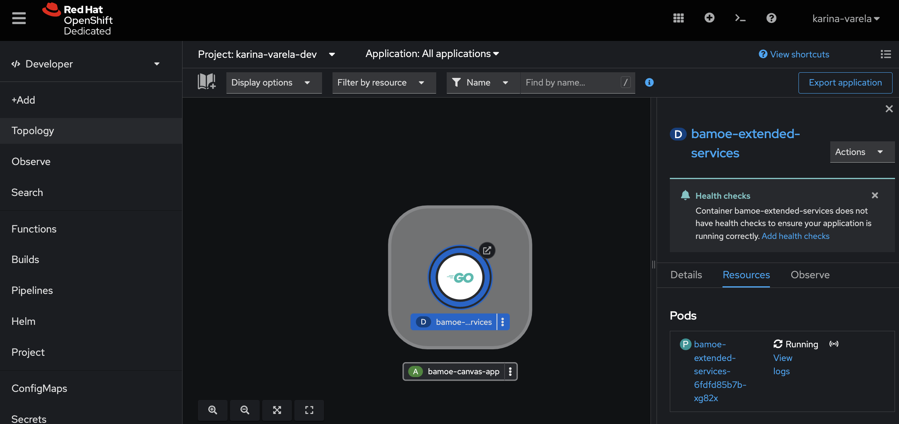
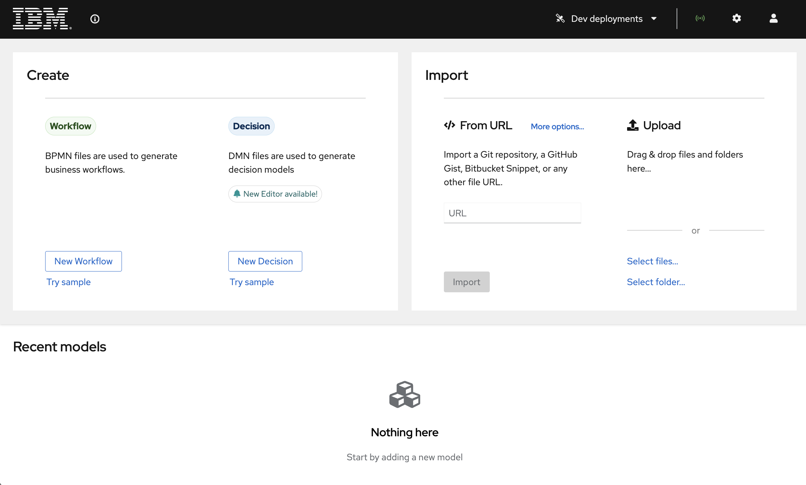
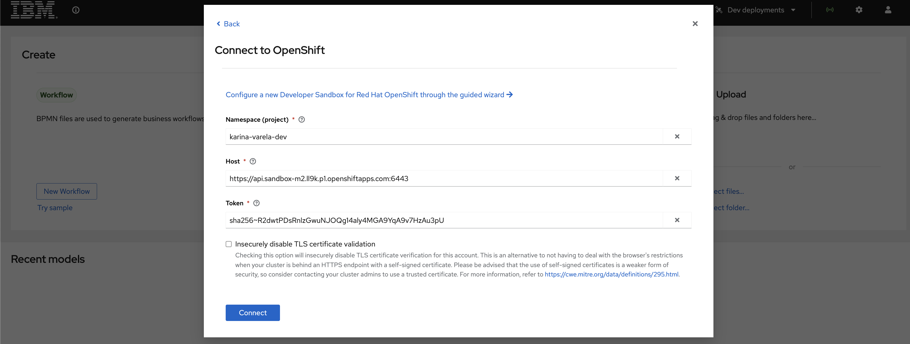
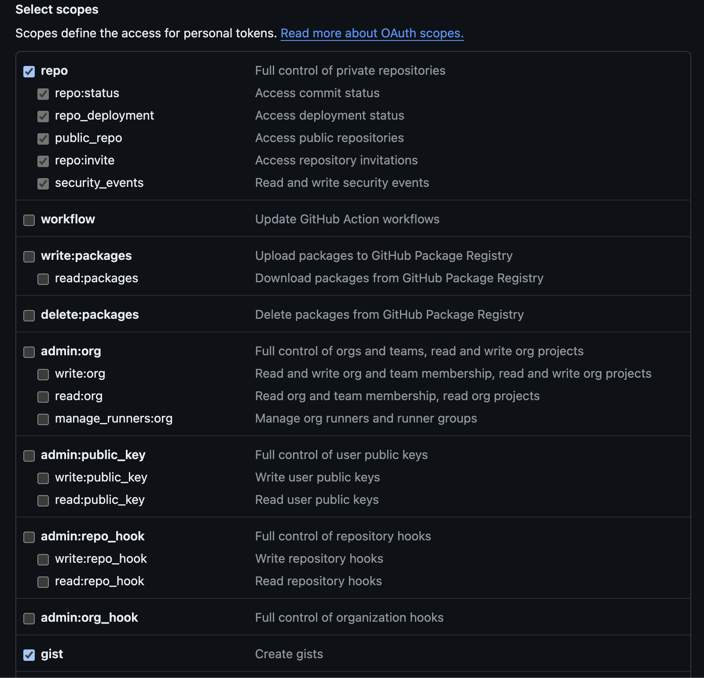

# Environment Setup

In this section, we will set up the necessary environment to start working with IBM Business Automation Manager Open Editions (BAMOE).

## Prerequisites

Below is the list of technologies you will need.

- Java JDK 17 
- Maven 3.9.6
- OpenShift 4.15
  (_Need an OpenShift? Try the [Dev Sandbox for Red Hat OpenShift](#need-an-openshift-environment-developer-sandbox-for-red-hat-openshift) for free._)
- Git CLI
- Microsoft VSCode (latest version) _(Need the IDE? Get it here: VSCode [download page](https://code.visualstudio.com/download).)_

!!! tip

    For more information about the supported environments of IBM BAMOE, refer to the [official documentation](https://www.ibm.com/docs/en/ibamoe/9.1.x?topic=notes-supported-environments)

You may need an account on these websites in order to rely on easy to use cloud services in some of the exercises:

- [GitHub](https://github.com/join) - for versioning projects on GitHub
- [Red Hat](https://sso.redhat.com/auth/realms/redhat-external/login-actions/registration?client_id=rhd-web&tab_id=sVjHBtrVNrA) - For those using Dev Sandbox for OpenShift 
- [IBM](https://www.ibm.com/cloud/free) - For using IBM's managed Kafka service

**Verifying Installed Software & Version**

To verify if you have the correct versions installed, you can use the following commands:

```sh
java -version
mvn -version
oc version
git --version
```
### Preparing VSCode and OpenShift Dev Sandbox

If you have an OpenShift instance ready to use, and if the IBM BAMOE Dev Tools extension is already installed your VSCode IDE, you can jump to [installing canvas](#installing-canvas-on-red-hat-openshift-container-platform-ocp) 

#### Setting Up Local Development Environment with VS Code

For running through the exercises, we'll use **Visual Studio Code** combined with IBM BAMOE Developer Tools Extension for Microsoft VSCode.

#### Setting Up IBM BAMOE Developer Tools for VS Code

To install BAMOE Dev Tools, open your IDE and go through the following steps:

1. Go to the Extensions view by clicking on the Extensions icon in the Activity Bar on the side of the window or by pressing `Ctrl+Shift+X`.
2. In the search box, type `IBM BAMOE Developer Tools`.
3. Click the Install button for the IBM BAMOE Developer Tools extension.

{:width="800px"}

##### Need an OpenShift Environment? Developer Sandbox for Red Hat OpenShift

To go through the OpenShift exercises, you'll need an OpenShift environment up and running. You can use any instance where you have access within a project. If you need a free, easy-to-setup OpenShift for our learning purposes, you can use the [Developer Sandbox for Red Hat OpenShift](https://developers.redhat.com/developer-sandbox).

As stated by Red Hat:
_"The Developer Sandbox for Red Hat OpenShift provides you with 30 days of no-cost access to a shared cluster on OpenShift, an enterprise-grade Kubernetes-based platform. Get instant access to your own minimal, preconfigured OpenShift environment for development and testing, hosted and managed by Red Hat."_

{:width="800px"}

After you log-in and create a sandbox on the page above, you'll get to access your OpenShift:

{:width="800px"}

In this environment, you have access to a namespace named with `your-username-dev` (e.g. `karina-varela-dev`).

#### Login to access OpenShift from your Terminal

To deploy BAMOE Canvas to OpenShift, you will need your OpenShift login token. Follow these steps to retrieve it using the OpenShift web console:

1. **Log in to the OpenShift Web Console**:
   - Open your web browser and navigate to your OpenShift cluster's web console URL.
   - Enter your username and password to log in.

2. **Accessing the Token**:
   - Click on your username in the top-right corner of the console, and select "**Copy Login Command**" from the dropdown menu.
     
   - A new page will open with your login token. Click on the "**Display Token**" button to view your token.
   - Copy the login token provided.

3. **Using the Token to log-in in your terminal**:
   - Open your terminal.
   - Log in to the OpenShift cluster using the `oc` CLI with the following command:

     ```sh
     oc login --token=<your-token> --server=<your-openshift-api-url>
     ```


---

Next, let's install Canvas on OpenShift.


### Installing Canvas on Red Hat OpenShift Container Platform (OCP)

IBM BAMOE Canvas is a web application that provides authoring tools for standards based business assets, directly in the browser. It allows users to create, edit, and manage decisions and processes, integrate with git for syncing repositories, and during development phase, deploy files to OpenShift and Kubernetes.

To install Canvas on a container platform, we need to install three resources:

- Extended Services
- CORS Proxy
- IBM BAMOE Canvas

Let's go through the installation and recall the purpose of these resources.

#### Installation Steps

In this section, we will install BAMOE Canvas on an OpenShift cluster. By using a manual installation process, you can have a better view of the resources created on OCP during the installation.  

!!! note

    Users who can install `helm` locally, can refer to the official documentation on how to [Install Canvas with Helm](https://www.ibm.com/docs/en/ibamoe/9.1.x?topic=canvas-using-helm-charts).

### Installing Canvas on OpenShift

Let's install **Canvas**, the environment we'll explore on the next lab for experimenting with automation services development with IBM BAMOE. 

**Canvas** is a powerful web application that provides tools for authoring decisions and workflows directly in the browser. It integrates seamlessly with Git for version control and with OpenShift for deploying your models for development validation purposes.

1. **Deploy Extended Services**
   
    Extended Services are back-end services that provide additional features to Canvas, such as the DMN Runner (execution and validation of decision models) and a proxy (enables communication with OpenShift and Kubernetes clusters).

    ```sh
    export APP_PART_OF=bamoe-canvas-app
    export APP_NAME_EXTENDED_SERVICES=bamoe-extended-services
    oc new-app quay.io/bamoe/extended-services:9.1.0-ibm-0001 --name=$APP_NAME_EXTENDED_SERVICES
    oc create route edge --service=$APP_NAME_EXTENDED_SERVICES
    oc label services/$APP_NAME_EXTENDED_SERVICES app.kubernetes.io/part-of=$APP_PART_OF
    oc label routes/$APP_NAME_EXTENDED_SERVICES app.kubernetes.io/part-of=$APP_PART_OF
    oc label deployments/$APP_NAME_EXTENDED_SERVICES app.kubernetes.io/part-of=$APP_PART_OF
    oc label deployments/$APP_NAME_EXTENDED_SERVICES app.openshift.io/runtime=golang
    ```

    If you check your OpenShift console, you should be able to see the new pod is up and running. You can do the same observation for the next two deployments as well. 

    


2. **Deploy CORS Proxy**
   
    The CORS Proxy allows BAMOE Canvas to communicate with Git providers like GitHub, Gitlab and Bitbucket.

    ```sh
    export APP_NAME_CORS_PROXY=bamoe-cors-proxy
    oc new-app quay.io/bamoe/cors-proxy:9.1.0-ibm-0001 --name=$APP_NAME_CORS_PROXY
    oc create route edge --service=$APP_NAME_CORS_PROXY
    oc label services/$APP_NAME_CORS_PROXY app.kubernetes.io/part-of=$APP_PART_OF
    oc label routes/$APP_NAME_CORS_PROXY app.kubernetes.io/part-of=$APP_PART_OF
    oc label deployments/$APP_NAME_CORS_PROXY app.kubernetes.io/part-of=$APP_PART_OF
    oc label deployments/$APP_NAME_CORS_PROXY app.openshift.io/runtime=nodejs
    ```

3. **Deploy BAMOE Canvas**

    Finally, deploy the BAMOE Canvas image, setting the environment variables required to connect it to the Extended Services and CORS Proxy backends.

    ```sh
    export APP_NAME_BAMOE_CANVAS=bamoe-canvas
    oc new-app quay.io/bamoe/canvas:9.1.0-ibm-0001 --name=$APP_NAME_BAMOE_CANVAS \
   --env=KIE_SANDBOX_EXTENDED_SERVICES_URL=https://$(oc get route $APP_NAME_EXTENDED_SERVICES --output jsonpath={.spec.host}) \
   --env=KIE_SANDBOX_CORS_PROXY_URL=https://$(oc get route $APP_NAME_CORS_PROXY --output jsonpath={.spec.host})
    oc create route edge --service=$APP_NAME_BAMOE_CANVAS
    oc label services/$APP_NAME_BAMOE_CANVAS app.kubernetes.io/part-of=$APP_PART_OF
    oc label routes=$APP_NAME_BAMOE_CANVAS app.kubernetes.io/part-of=$APP_PART_OF
    oc label deployments/$APP_NAME_BAMOE_CANVAS app.kubernetes.io/part-of=$APP_PART_OF
    oc label deployments/$APP_NAME_BAMOE_CANVAS app.openshift.io/runtime=js
    ```

4. Access IBM BAMOE Canvas

    If all went well, you should be able to see three pods - either on the OCP web console or using the cli to retrieve the pods of the current namespace: `oc get pods`. You should see something like:

    ```sh
    oc get pods
    NAME                                       READY   STATUS    RESTARTS   
    bamoe-canvas-54f87f584c-dpjr6              1/1     Running   0          
    bamoe-cors-proxy-578bf787cb-rc4t8          1/1     Running   0          
    bamoe-extended-services-6fdfd85b7b-xg82x   1/1     Running   0          
    ```
   
    Your IBM BAMOE Canvas instance should be up and accessible. To get Canvas' URL, run this command:
   
    ```sh
    oc get route $APP_NAME_BAMOE_CANVAS --output jsonpath={.spec.host}; echo
    ```
   
    The retrieved URL would look something like 

    `bamoe-canvas-username-dev.apps.sandbox-id.p1.openshiftapps.com/#/`. 
   
    The URL should lead to your new installation of Canvas:
   
    

---

:material-check-circle-outline: _With your development tools prepared, you're now ready to start exploring the solution in more detail. Let's move on to exploring Canvas with Decision Automation._

### Preparing Canvas for Integrating with Git and OpenShift

To be able to use the maximum potential of Canvas, let's set up the integration with Git and OpenShift.

In Canvas, execute the following procedures to set up the integration:

#### Connect Canvas to OpenShift for Deployment and Integration

1. In Canvas, click on the "User" icon on the top-right corner, and click on "Connect to an account".
2. Select OpenShift.
   

3. Enter the OpenShift API URL and your project name. You can obtain them through the web console or using the CLI commands below to retrieve the namespace, API URL, and authentication token respectively:

    ```sh
    oc project -q 
    oc whoami --show-server 
    oc whoami --show-token
    ```
   
    Configuration sample:
    

    Integration Successful:
    

4. Save the settings.

Your Canvas can now run dev deployments of your decision services on OpenShift! To wrap up, let's configure github integration. 

### Connect Canvas to GitHub for Version Control and Collaboration

1. In Canvas, go to the settings menu and select "GitHub Integration".!
2. Click on **Generate new token**. You'll be redirected to the GitHub page where you can create a token for Canvas to authenticate on GitHub with the given permissions. 

   

3. In GitHub, create a new classic token
   

5. Choose a `note` (any description for this token) and the permissions for 'repo' and 'gist' scopes.

   

4. On the bottom of the page, click on "**Generate Token**". Copy and save the generated token, you'll need it in Canvas.  
3. Now back in Canvas, enter your GitHub repository URL and personal access token. You should see a green message informing you have **Successfully connected**.

---

:material-check-circle-outline: _Awesome!! You're all set! With your development tools prepared, you're now ready to start exploring the solution in more detail. Let's move on to exploring Canvas with Decision Automation._

