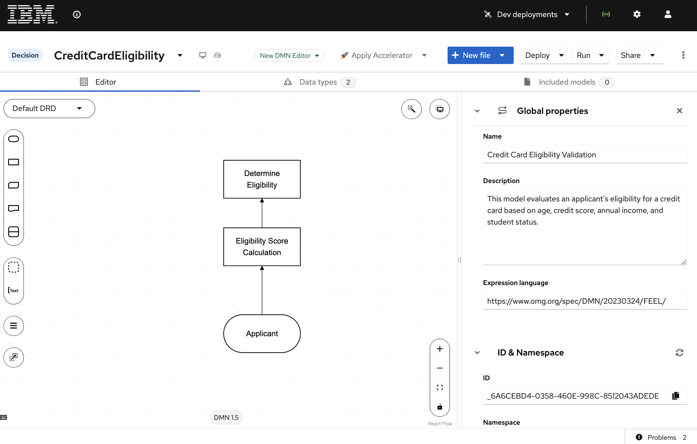

# Exploring Canvas & Decisions

In this section, we will import an existing DMN project into BAMOE Canvas and explore its decision models and automation capabilities.

## Value of DMN Automation

1. **Consistency**: Ensures uniform application of eligibility criteria across all applications.
2. **Efficiency**: Rapidly processes applications, reducing manual workload.
3. **Flexibility**: Allows easy updates to decision logic without changing the underlying process.
4. **Transparency**: Provides clear decision rationale, aiding in regulatory compliance.
5. **Scalability**: Handles increasing application volumes without proportional increase in resources.

## Importing DMN Projects into Canvas

To start, let's import a DMN file into Canvas. We will use a credit card eligibility use case to illustrate this process.

1. Open Canvas in your browser.
2. To import the DMN file, in Canvas go to the Import menu and select "From URL".
3. Copy and paste the following link and click **Import**: https://github.com/kmacedovarela/cc-application-approval-starter/blob/main/src/main/resources/CreditCardEligibility.dmn 

## Credit Card Eligibility DMN Model

This DMN (Decision Model and Notation) model automates the initial eligibility assessment for credit card applications.



It evaluates applicant information to determine whether an application should be automatically approved, rejected, or sent for manual review.

### Key Elements

1. **Input Node**: Applicant information (age, credit score, annual income, student status)
2. **Decision Nodes**:
   - Eligibility Score Calculation: Assigns a score based on applicant criteria
   - Determine Eligibility: Interprets the score to make a final decision
3. **Output**: Eligibility result (Approved, Rejected, or Manual Review)

## Exploring the Decision Model

1. Click on the Data Types tab. In it, you can see the `Applicant` type, which includes the attributes: age (Number), creditScore (Number), annualIncome (Number), and isStudent (Boolean).
   

2. Now, click on the `Editor` tab and let's check the decision nodes. Click on the `Eligibility Score Calculation` node and observe it is of type Number and contains a decision table for calculating the eligibility score based on the applicant's criteria.
3. Next, check the `Determine Eligibility` decision node, which is of type String and uses a FEEL expression to determine the eligibility result based on the calculated score.

## Running the Decision

1. Click on the Run button to see the form that was automatically generated on the right side of the screen.
   

2. Try out the decision using the test scenarios below.

   **Test Scenarios**

   Some examples of input and output data that can validate the decision:

   | Is Student | Annual Income | Credit Score | Age | Expected Output |
   |------------|---------------|--------------|-----|-----------------|
   | false      | 30000         | 700          | 17  | Rejected        |
   | false      | 40000         | 500          | 25  | Manual Review   |
   | false      | 60000         | 720          | 30  | Approved        |
   | true       | 5000          | 600          | 19  | Approved        |
   | false      | 80000         | 650          | 45  | Approved        |


## Using the Dev Deployment

### About the Dev Deployment

Dev deployments in BAMOE Canvas allow you to deploy Decisions to both local Kubernetes instances and remote Kubernetes/OpenShift environments for development purposes.

With it, you can deploy all Decisions within a project. After a short deployment process, you will be able to access a web application provided by BAMOE Canvas for testing and interacting with your Decisions. This web application includes a form similar to the one you used when running a decision in Canvas. Along with the form, it also provides access to the Swagger UI with the Decisions' API information.

!!! tip

    Dev deployments are immutable, meaning if you need to make changes or if an error occurs, you must create a new deployment. Dev deployments can be easily managed and deleted from the Dev deployments dropdown.

### Steps to Deploy

1. With the decision model opened, click on deploy.
2. In the pop-up that opens up, choose the option "Kogito Quarkus Blank App" for "Choose your deployment option".
    

3. Check the checkbox for "Whether to deploy the DMN Form Webapp as a sidecar container or not".
4. Click on confirm.
5. Click on "Dev Deployments" on the top menu bar to show the deployment status.
     

6. When available (shows a green check), click on it to open the deployed service on a new page.

A new browser tab will open on a URL similar to this: `https://dev-deployment-yliell9512.apps.sandbox-m2.ll9k.p1.openshiftapps.com/form-webapp/#/form/Credit%20Card%20Eligibility%20Validation`, showing an automatically generated form.

!!! **Note**:
Dev deployments are intended to be used for development purposes only, so users should not use the deployed services in production or for any type of business-critical workloads.

### Testing the REST APIs

After opening the deployed service by opening the service URL, append `/q/swagger-ui` to the URL to access the APIs.

This is based on OpenAPI. You can access the OpenAPI file by opening `/q/openapi`.

#### Evaluating a Decision using REST 

Let's try using the POST endpoint available in swagger to fire a decision.

1. Access the swagger ui in the deployed decision service. Locate and click on the endpoint: POST `/Credit Card Eligibility Validation` 

1. Click on edit to use the input:

   ```json
   {
     "Applicant": {
       "isStudent": false,
       "annualIncome": 30000,
       "creditScore": 700,
       "age": 17
     }
   }
   ```

2. Observe the output, which should be similar to:
   ```json
   {
     "Eligibility Score Calculation": 700,
     "Determine Eligibility": "Rejected",
     "Applicant": {
       "isStudent": false,
       "annualIncome": 30000,
       "creditScore": 700,
       "age": 17
     }
   }
   ```

---

:material-check-circle-outline: _Awesome!! You've successfully imported and explored a DMN project in Canvas. Now that you've seen how to model and test decisions._
