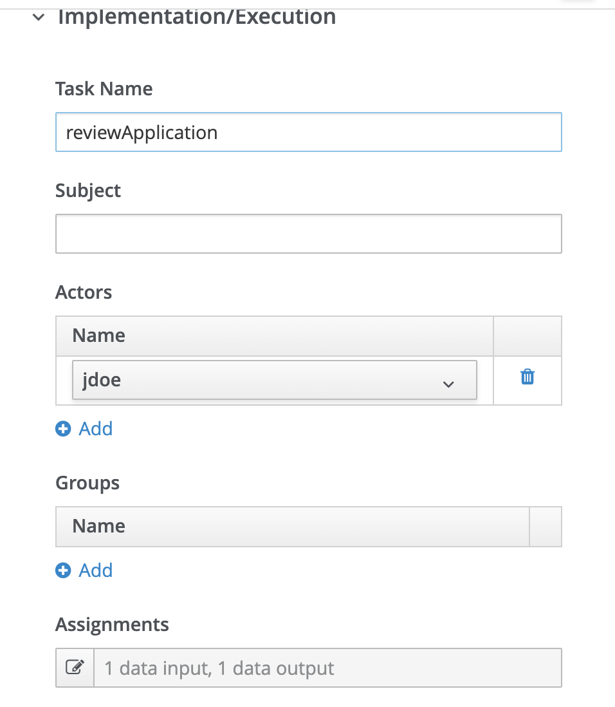
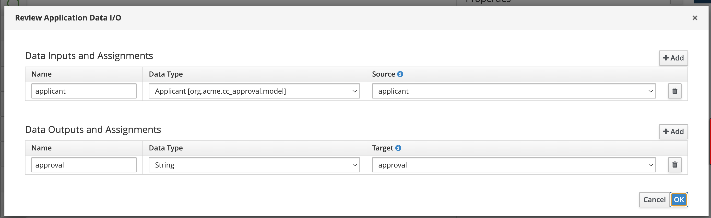
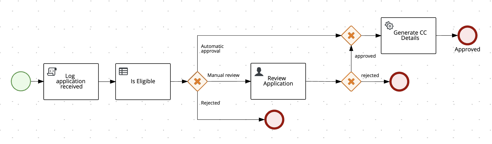
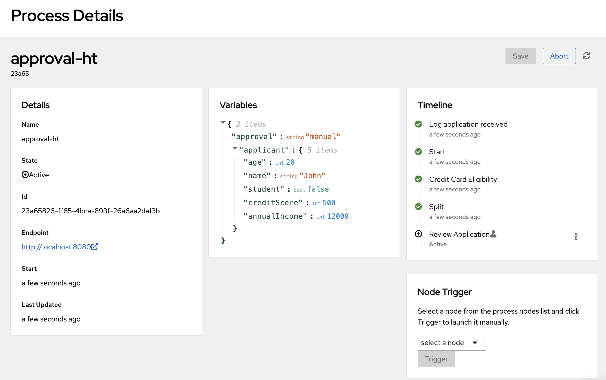
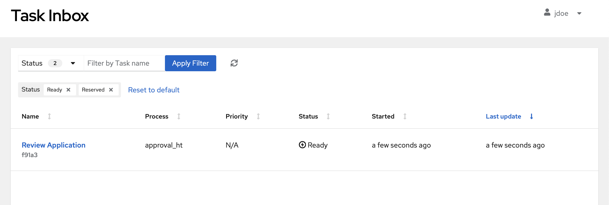

# User tasks for manual approval
 
When the decision outcome indicates the need of a manual approval, the flow should move forward to a user task. Let's add this manual step in the process, and see it in action.

About the process:
- When an application requires manual review, it now goes to the "Review Application" task.
- The assigned user (jdoe) reviews the application and decides to approve or reject it.
- Based on the decision (stored in the `approval` variable), the process takes one of two paths:
   1. If approved, it proceeds to generate credit card details.
   2. If rejected, it ends the process immediately.
  
## Manual approval

1. Add a new user task on your process, on the "manual approval" path.

2. Configure the task with the name "Review Application", and:
   - Set the Actor to: `jdoe`
     - Input Assignment:
        - Name: `applicant`
        - Data Type: `Applicant`
        - Source: `applicant`
     - Output Assignment:
        - Name: `approval`
        - Data Type: `String`
        - Target: `approval`

       
       

5. Now, re-model your process so that it looks like this:  

    

8. You can configure the sequence flows after the human task such as:
   - For the "approved" path:
        - Set the condition to: `return approval.toLowerCase().equals("approved");`
   - For the "rejected" path:
      - Set the condition to: `return approval.toLowerCase().equals("rejected");`

## Testing the Updated Process

1. Start Quarkus in dev mode.
2. Open the Quarkus Dev UI in your browser.
3. Start a new process instance that would route to manual review.

    

4. You should see a task assigned to user "jdoe".
5. Switch to "jdoe" and complete the task, choosing either "approved" or "rejected".

    

6. Observe how the process follows the appropriate path based on your decision.
7. If approved, verify that credit card details are generated.
8. If rejected, confirm that the process ends without generating card details.

-----

:material-check-circle-outline: _By adding this human task, you've introduced a crucial manual review step into your process, allowing for human decision-making in complex or borderline cases. This enhances the flexibility and robustness of your credit card approval process._