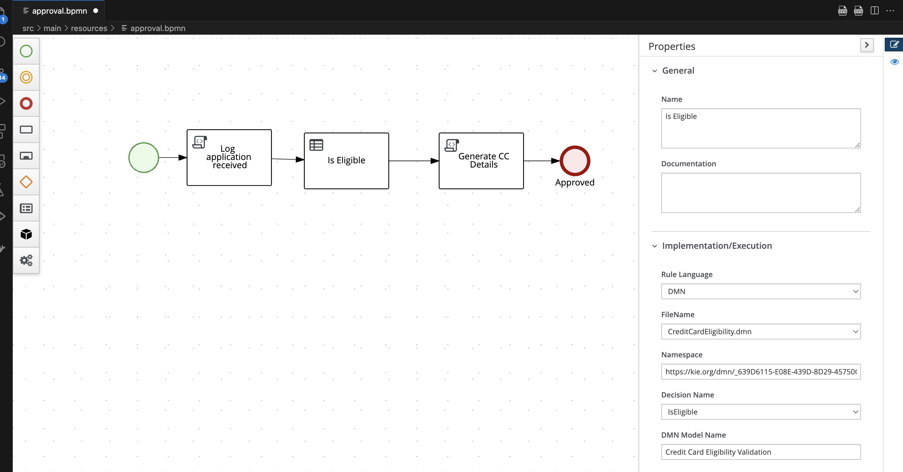
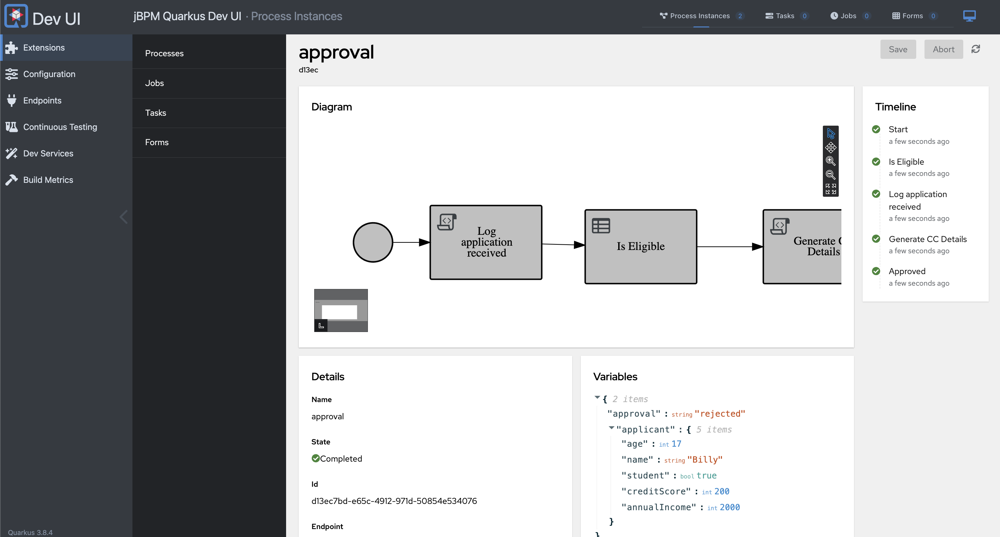

# Automating Decisions in Processes with DMN

In this section, you will learn how to use DMN-based business rules task to automate decisions in your process, leveraging process variables and data types.

1. Locate the script task named `Check Card Eligibility` in your process diagram and **delete it**.
2. Add a new **business rules task** to the process diagram.

     

## Configuring the Business Rules Task

**Task Configuration:**

- Rule Language: DMN
- Filename: CreditCardEligibility.dmn
- Namespace: https://kie.org/dmn/_639D6115-E08E-439D-8D29-45750C32DB28
- Decision Name: IsEligible
- DMN Model Name: Credit Card Eligibility Validation

   

**Assignments:**

- Input: Applicant, org.acme.cc_approval.model.Applicant, applicant
- Output: IsEligible, String, approval

   

## Validating the DMN Configuration

1. Open the DMN File and verify that the `Applicant` data type is part of the DMN model and matches the process variable. 
2. Now, open the class `org.acme.cc_approval.model.Applicant` and check the attributes there. See the similarity with the data type? 
   
The process variable `applicant` matches the data type in the DMN model, ensuring seamless data flow between the process and the decision model.

## Running the Process with DMN Automation

1. Start Quarkus in Dev Mode:

     ```sh
     mvn quarkus:dev
     ```

2. Open the Dev UI, navigate to `http://localhost:8080/q/dev-ui`. 
3. Start a new process instance from the approval process definition.
4. Check Process Variables: Verify the variables of the completed instance to ensure the DMN decision was executed correctly.

    

   
   | Scenario              | Is Student | Annual Income | Credit Score | Age |
   |-----------------------|------------|---------------|--------------|-----|
   | Automatic Approval    | false      | 15000         | 750          | 25  |
   | Automatic Rejection   | false      | 15000         | 750          | 17  |
   | Manual Review         | false      | 30000         | 600          | 20  |
   
   These test scenarios help you validate different outcomes based on the input data for the DMN-based decision automation.

5. Test with different data that will result on different outcomes in the decision: 


6. Stop Quarkus and close the dev ui in your browser.

---


